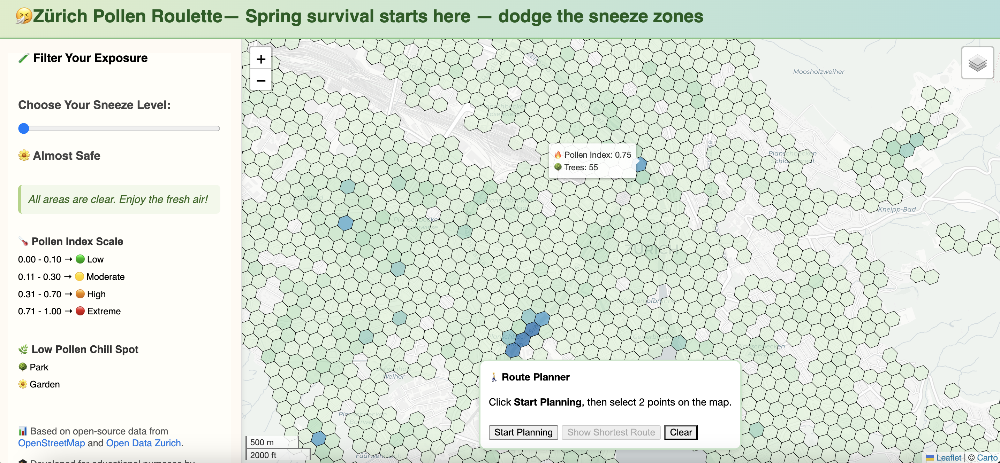

# 🤧 Zürich Pollen Roulette

**Spring survival starts here — dodge the sneeze zones!**

Zürich Pollen Roulette is a playful, data-driven web app that helps allergy-prone folks *strategically avoid high pollen areas* and find nearby chill spots like parks and gardens — all wrapped in a fun, interactive map.

🌼 Whether you're a seasonal sneezer or just pollen-curious, this app has your back (and your nose).

## 🔍 What Can You Do?

- 🎚️ **Filter** areas based on how intense the pollen exposure is (from "Almost Safe" to "Pollenocalypse").
- 🗺️ **Explore** fine-grained pollen hotspots, tree density, and allergy-safe chill zones.
- 🧭 **Visualize the shortest walking route** between two points in the city — this helps demonstrate how routing works and sets the stage for future pollen-aware paths.
- 📊 **Learn** how open data can power health-friendly, citizen-centric urban tools.

## 🔗 Try It Live

👉 [**Zürich Pollen Roulette**](https://sachit27.github.io/pollen-roulette/)

## 🖼️ Sneak Peek



> Hexagons indicate pollen intensity (based on local tree data). The darker the hex, the harder your allergies might hit. Chill spots are parks and gardens.

## 🌳 Data Sources

This app proudly builds on Zürich’s amazing open data ecosystem, including:

- 🟢 **Fine-grained tree, canopy cover, and species data** from [Stadt Zürich Open Data](https://data.stadt-zuerich.ch/)
- 🗺️ **OpenStreetMap (OSM)** for base layers and park/garden information
- 📐 Spatial aggregation and scoring of tree pollen potential across the city

This allows us to create **hyperlocal pollen indexes** that make your walks smarter — and less sneezy.

## 🧠 Built With

- [React + Vite](https://vitejs.dev)
- [Leaflet.js](https://leafletjs.com) for interactive mapping
- [chroma.js](https://vis4.net/chromajs/) for color scales
- [OpenRouteService](https://openrouteservice.org/) for routing

## 🗂️ How It Works

- 🌲 Tree data is scored based on pollen potential and spatially aggregated using hex bins.
- 🎯 Chill zones are identified using OSM categories for parks and gardens.
- 🛣️ The route planner uses OpenStreetMap's **shortest walking path**, helping visualize how future pollen-aware routing could work.

## 📦 Development Setup

Clone and run locally:
```bash
git clone https://github.com/sachit27/pollen-roulette.git
cd pollen-roulette
npm install
npm run dev
